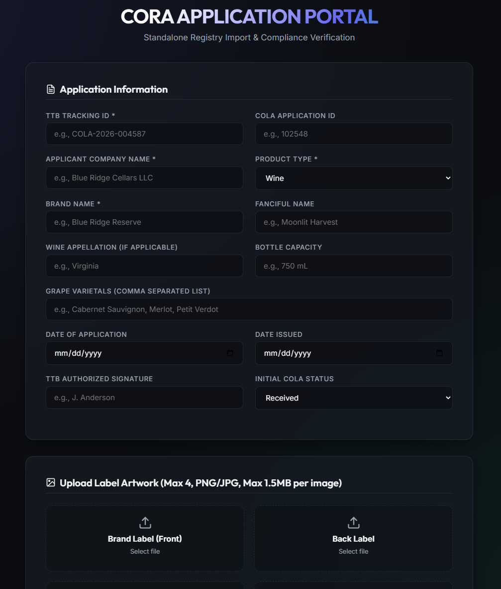

# CORA - Compliance and Operations Review Application

## Overview

CORA is a Django web application for managing label compliance operations and alcohol label verification using OCR.



### Architectural Strategy
* **Queue Engine:** Local Docker-based Postgres utilizing the pre-compiled `PGMQ` extension (via `ghcr.io/pgmq/pg18-pgmq:latest`).
* **Design Pattern:** Claim Check Pattern. Raw image payloads (up to 4 files at 1.5MB each) are written straight to shared local disk storage, passing only the lightweight `Application ID` metadata through the message queue.
* **Throughput Profile:** Hourly bursts up to 100 messages/hour (~500 messages/day).

 ### How the System Works in this Docker Network
 1. The API Upload: A client POSTs an application with up to four 1.5MB images to http://localhost:8000/application/import.
 2. Writing to Host Disk: The web container receives the files and streams them straight into /app/media/. Because of your volume mappings, the files appear instantly on your host machine at ~/var/media/​.
 3. The Claim Check: The web container updates the PGMQ database table on the postgres container, passing only the Application ID.
 4. Worker Processing: The worker container pulls the Application ID from the database queue. It looks into its own internal /app/media/ directory, opens the exact same files written by the web container, and executes your image processing tasks with zero network or database transmission overhead.

## Quick Start

### Prerequisites

- Python 3.14+
- `uv` installed
   ```bash
   uv python install 3.14
   uv venv --python 3.14
   source .venv/bin/activate
   uv sync
   ```
- Project `pyproject.toml` in the repo root

### Installation

1. Install dependencies with `uv`:
   ```bash
   uv sync
   ```

2. Activate the managed virtual environment:
   ```bash
   source .venv/bin/activate
   ```

3. Install dev/test extras if needed:
   ```bash
   uv sync --all-extras
   ```

4. Run database migrations:
   ```bash
   sudo docker compose up -d postgres
   uv run python manage.py migrate --run-syncdb --noinput
   ```

5. TODO: Create a superuser (for admin access):
   ```bash
   uv run python manage.py createsuperuser
   ```

6. Start the development server:
   ```bash
   uv run python manage.py runserver
   ```

7. Visit http://localhost:8000/ping in your browser.
8. Visit http://localhost:8000/application/import in your browser.

## Canonical Commands

Use the project's canonical commands for lint, checks, and tests:

```bash
# Django system checks
uv run python manage.py check

# Test runner
uv run python -m pytest
```

Current tests live in `cora/tests.py`.

## Docker Compose

Use the included Compose file for Postgres + PGMQ:
```bash
docker compose up --build
```

The service uses `ghcr.io/pgmq/pg18-pgmq:latest` and exposes the database on the configured host port (default `5432`). The app connects to a local Postgres database by default. Local connection example:

```bash
psql -U cora -h localhost -d cora
```

Use `docker compose down` to stop the database when you're done.

### PGMQ Extension

The Postgres image already includes PGMQ. If you need to create the extension manually:
```bash
docker exec -it cora_postgres psql -U cora -d cora_db -c "CREATE EXTENSION IF NOT EXISTS pgmq CASCADE;"
```

## Project Structure

```


cora/
├── cora/                 # Project configuration
│   ├── settings.py      # Django settings
│   ├── urls.py          # Root URL configuration
│   ├── wsgi.py
│   ├── asgi.py
│   ├── views.py         # View logic
│   ├── models.py        # Database models
│   ├── tasks.py         # Background task stubs
│   ├── pgmq.py          # PGMQ producer helpers
│   ├── tests.py         # Test suite
│   └── templates/
│       └── cora/
│           ├── import.html
│           ├── application_detail.html
│           └── application_list.html
├── static/              # Project-wide static files
├── templates/           # Global template overrides (optional)
├── media/               # Uploaded label images (gitignored)
├── db.sqlite3           # SQLite database (dev)
├── docker-compose.yml   # Local Postgres + PGMQ
├── pyproject.toml       # uv project manifest + deps
└── manage.py            # Django management script


```

## Technology Stack

- Backend: Django 6.0
- Database: PostgreSQL + PGMQ (or SQLite for development)
- Frontend: HTML/CSS/JavaScript with HTMX
- OCR: PaddleOCR (planned)
- Testing: pytest

## Features

- Product enrollment and management
- Label image upload
- OCR-based label verification
- Compliance checking
- Batch processing support

