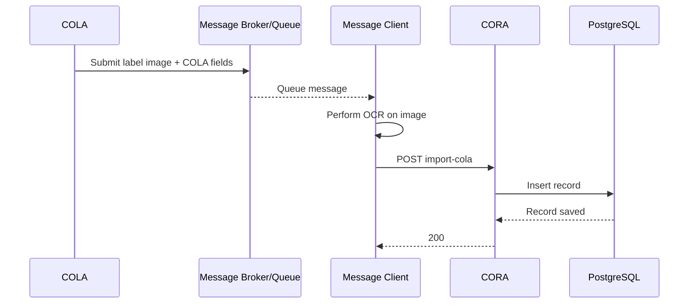
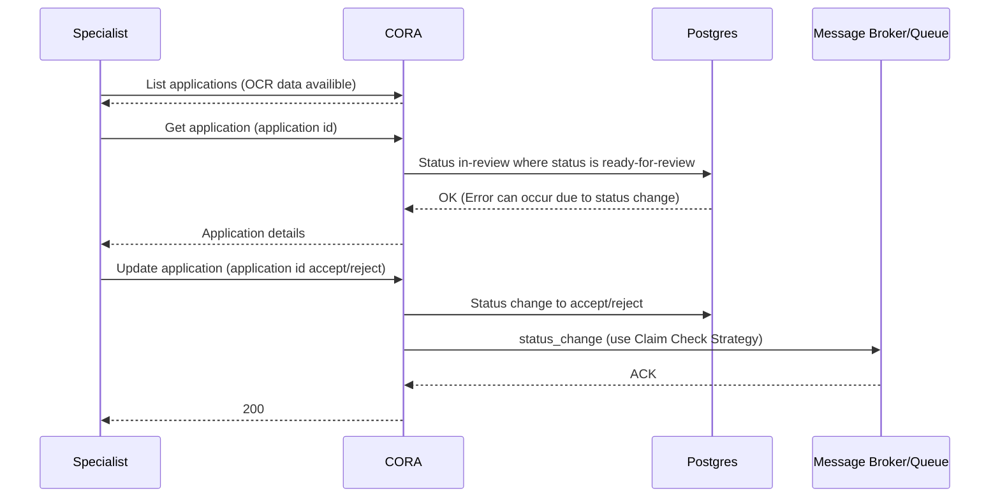

# COLA Import
Record enter `CORA` though a message broker. A message client listens on the queue. The message includes a label image along with values from `COLA` entered by the Applicant. 
The message client performs OCR on the image.
Finally, the message is inserted into Postgres by calling `CORA` `import-cola`

# Specialist Review

* The Specialist start by getting a list of application that have been OCR-ed, but not reviewed.
* CORA return a pageable list of applications 'ready for review'.
* The Specialist selects an item.
* CORA updates Postgress for that application to change status in 'in review'.
* The Specialist reviews the item and approves/rejects the application.
* CORA update the application status in the database.
* CORA sends a message to the broker.

NOTE: Interaction between Message Broker and Cola are ommitted for brevity.

