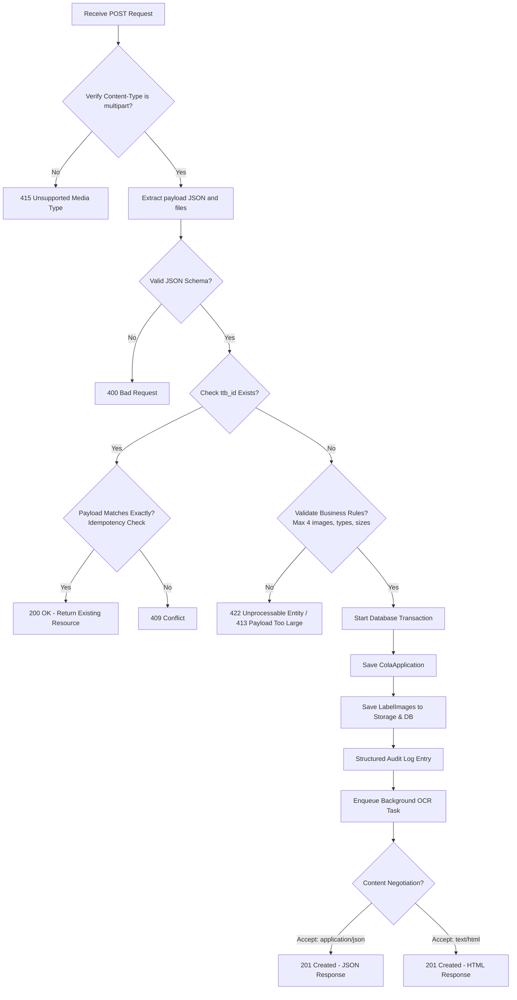

# Implementation Plan: Route `/application/import`

This document details the step-by-step implementation plan for the `/application/import` endpoint in **CORA**, aligning with the requirements in `docs/use_cases/02-Route-application-import.md`, project requirements (`docs/requirements.md`), and existing technical decisions (`docs/decisions.md`).

---

## 1. Objectives & Key Requirements

| ID | Requirement | Target Implementation |
|---|---|---|
| **BR-001** | `ttb_id` must be unique | Enforced via database constraint (`unique=True` on model field) and view-level validation. |
| **BR-002** | Max 4 label images | Check `len(label_images) <= 4` on the incoming payload before processing. |
| **BR-003** | Atomic database transaction | Wrap database operations in `transaction.atomic()`. |
| **BR-004** | Valid label types | Validate that `label_type` is one of `BRAND`, `BACK`, `NECK`, `OTHER`. |
| **BR-005 / BR-009** | Idempotency & Conflict | Existing `ttb_id` checks for an idempotent retry. Exact match returns `200 OK` + resource; mismatch returns `409 Conflict`. |
| **BR-006** | Ignore/Reject server fields | Strip `id` and timestamps (`created_at`, `updated_at`, etc.) from incoming payload during creation. |
| **BR-007 / BR-013** | Structured audit logging | Log structured message including `ttb_id`, `applicant_name`, and `fanciful_name` on successful import. |
| **BR-008** | Content negotiation | Support `Accept: application/json` (returns JSON) and `Accept: text/html` (returns HTML response). |
| **BR-010** | Stream uploads | Django handles file uploads using `TemporaryFileUploadHandler` for large files to avoid memory exhaustion. |
| **BR-011** | Security: File size & format | Validate max size of 1.5MB per image and format compatibility (`PNG`, `JPG`). |
| **BR-012** | Authorization | Ensure endpoint is restricted to authorized clients/users. |

---

## 2. Technical Design

### A. Database Model Refinement

The current Django models in `cora/models.py` are simplistic placeholders (`ApplicationSubmit`, `ApplicationImage`). We will replace them with proper Django models matching the reverse-engineered schema in `docs/cola_database_reverse_engineered.md`.

```python
# cora/models.py
import os
from django.db import models

def get_label_upload_path(instance, filename):
    # Isolates identical filenames in distinct subdirectories using the unique ttb_id
    return f"cola/{instance.cola_application.ttb_id}/{filename}"

class ColaApplication(models.Model):
    # Internal surrogate key (id) auto-created by Django
    cola_application_id = models.BigIntegerField(null=True, blank=True)
    ttb_id = models.CharField(max_length=50, unique=True, db_index=True)
    applicant_name = models.CharField(max_length=255)
    product_type = models.CharField(max_length=30)  # e.g., WINE, DISTILLED_SPIRITS, MALT_BEVERAGES
    brand_name = models.CharField(max_length=255)
    fanciful_name = models.CharField(max_length=255, null=True, blank=True)
    grape_varietals = models.JSONField(null=True, blank=True)  # Store varietals array
    wine_appellation = models.CharField(max_length=255, null=True, blank=True)
    distinctive_bottle_capacity = models.CharField(max_length=50, null=True, blank=True)
    status = models.CharField(max_length=30, default='RECEIVED')
    date_of_application = models.DateField(null=True, blank=True)
    date_issued = models.DateField(null=True, blank=True)
    ttb_authorized_signature = models.CharField(max_length=255, null=True, blank=True)
    
    created_at = models.DateTimeField(auto_now_add=True)
    updated_at = models.DateTimeField(auto_now=True)
    archived_at = models.DateTimeField(null=True, blank=True)

    class Meta:
        db_table = 'cola_applications'

class LabelImage(models.Model):
    cola_application = models.ForeignKey(
        ColaApplication, 
        on_delete=models.CASCADE, 
        related_name='label_images'
    )
    label_type = models.CharField(max_length=30)  # BRAND, BACK, NECK, OTHER
    file_name = models.CharField(max_length=255)
    file_path = models.CharField(max_length=1024)
    file_size_bytes = models.BigIntegerField()
    width_px = models.IntegerField(null=True, blank=True)
    height_px = models.IntegerField(null=True, blank=True)
    image_format = models.CharField(max_length=10)  # PNG, JPG
    
    image = models.ImageField(upload_to=get_label_upload_path)
    created_at = models.DateTimeField(auto_now_add=True)

    class Meta:
        db_table = 'label_images'
```

### B. Endpoint Architecture (`GET` and `POST`)

#### `GET /application`
- **Content Negotiation**:
  - `Accept: application/json` -> Return the JSON Schema of the import payload.
  - `Accept: text/html` (or default browser) -> Render a user-friendly HTML upload form.
- **HTML Form**:
  - Features fields matching `ColaApplication` metadata.
  - Supports up to 4 file upload inputs (dynamically matches files to metadata image filenames).
  - Uses basic JavaScript to intercept submission, serialize metadata as JSON inside a `payload` field, and append binary files into a `multipart/form-data` request submitted asynchronously or synchronously.

#### `POST /application`
- Requires `multipart/form-data` Content-Type.
- Flow diagram of validation and ingestion pipeline:



### C. Idempotency & Comparison Logic
When a request arrives with an existing `ttb_id`:
1. Fetch the existing `ColaApplication` along with its `LabelImage` relations.
2. Compare metadata fields from the incoming payload against the DB record (excluding `id`, `created_at`, `updated_at`, `archived_at`).
3. Compare the image metadata list (`label_images`) against the DB records:
   - Match `label_type`, `file_name`, and size.
   - If files are uploaded, check that they match exactly.
4. If identical, return `200 OK` with:
   `{"success": true, "id": <existing_id>, "message": "Application imported (idempotent)."}`
5. If any field differs, return `409 Conflict`.

### D. File Streaming & Performance
To prevent memory exhaustion under `BR-010`:
- Django defaults to writing files larger than 2.5MB to disk (`TemporaryFileUploadHandler`).
- We will explicitly force `TemporaryFileUploadHandler` for this endpoint or configure it in `settings.py` to stream uploads cleanly.
- Ensure that image metadata calculations (width, height, format) use Python's `Pillow` library to read only the image headers rather than loading the entire file into memory.

### E. Structured Auditing (Observability)
A standard logging entry on successful import:
```json
{
  "timestamp": "2026-06-25T21:09:00Z",
  "level": "INFO",
  "event": "application_imported",
  "ttb_id": "COLA-2026-004587",
  "applicant_name": "Blue Ridge Cellars LLC",
  "fanciful_name": "Moonlit Harvest",
  "cola_application_id": 102548,
  "client_ip": "127.0.0.1"
}
```

---

## 3. Step-by-Step Implementation Tasks

### Phase 1: Database Migration
1. Modify [models.py](file:///home/rcapozzi/src/cora/cora/models.py) to declare `ColaApplication` and `LabelImage` models.
2. Run migrations:
   ```bash
   python3 manage.py makemigrations
   python3 manage.py migrate
   ```
3. Update [tasks.py](file:///home/rcapozzi/src/cora/cora/tasks.py) to process `ColaApplication` and `LabelImage` models instead of the old `ApplicationSubmit` and `ApplicationImage`.

### Phase 2: Core Import View Ingestion
1. Define JSON Schema for incoming `payload` validation.
2. Implement validation constraints (max 4 images, size <= 1.5MB, format in JPEG/PNG, types in BRAND/BACK/NECK/OTHER).
3. Implement metadata comparison helper for the idempotency/conflict check.
4. Implement atomic transaction block logic for saving the records and invoking `transaction.on_commit(lambda: ...)` to queue background processing.

### Phase 3: Content Negotiation & GET Form
1. Create GET handler logic returning either the JSON Schema or the HTML page based on `Accept` header.
2. Build Django template `templates/cora/import.html` for the interactive upload form.
3. Configure static files and CSS (using Vanilla CSS for high-quality aesthetics).

### Phase 4: Integration and URL Routing
1. Update [urls.py](file:///home/rcapozzi/src/cora/cora/urls.py) to include the new endpoint:
   `path('application/import', views.application_import, name='application_import')`

### Phase 5: Verification & Tests
1. Write unit tests in `cora/tests.py` covering:
   - Valid import returns `201 Created` (JSON/HTML).
   - Duplicate exact match returns `200 OK` (Idempotent).
   - Duplicate with different fields returns `409 Conflict`.
   - File size > 1.5MB returns validation error (`413` or `422`).
   - Invalid label type returns validation error (`422`).
   - More than 4 images returns validation error (`422` or `400`).
   - Non-authenticated calls are blocked (if auth enabled).

---

## 4. Verification Plan

### Test Cases Matrix
| Scenario | Request Headers / Payload | Expected HTTP Status | Expected Response format |
|---|---|---|---|
| **GET HTML Form** | `Accept: text/html` | `200 OK` | HTML document with upload form |
| **GET JSON Schema** | `Accept: application/json` | `200 OK` | JSON object containing schema |
| **Valid New POST** | `Accept: application/json`, payload + images <= 1.5MB | `201 Created` | JSON success message + application ID |
| **Idempotent POST** | Same payload + same images | `200 OK` | JSON success message + application ID |
| **Conflict POST** | Same `ttb_id`, but different `brand_name` | `409 Conflict` | JSON error body |
| **Payload Too Large** | One image size > 1.5MB | `413 Payload Too Large` / `422` | Error message |
| **Invalid Image Format** | File is `.txt` or `.gif` | `415 Unsupported Media Type` / `422` | Error message |
| **Too many images** | 5 images included | `422 Unprocessable Entity` / `400` | Error message |
