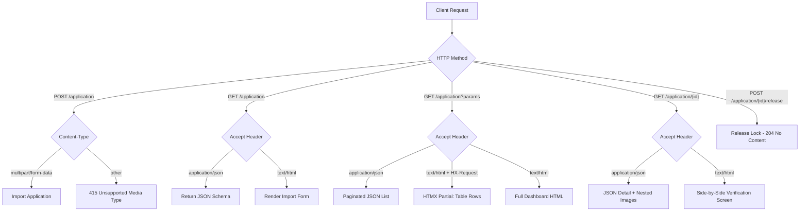
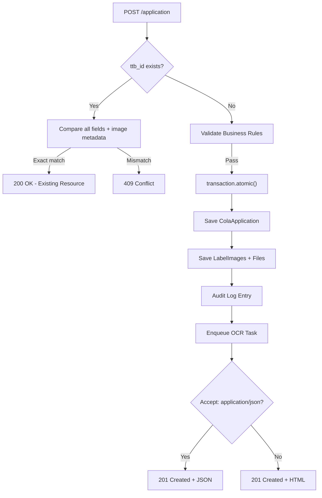
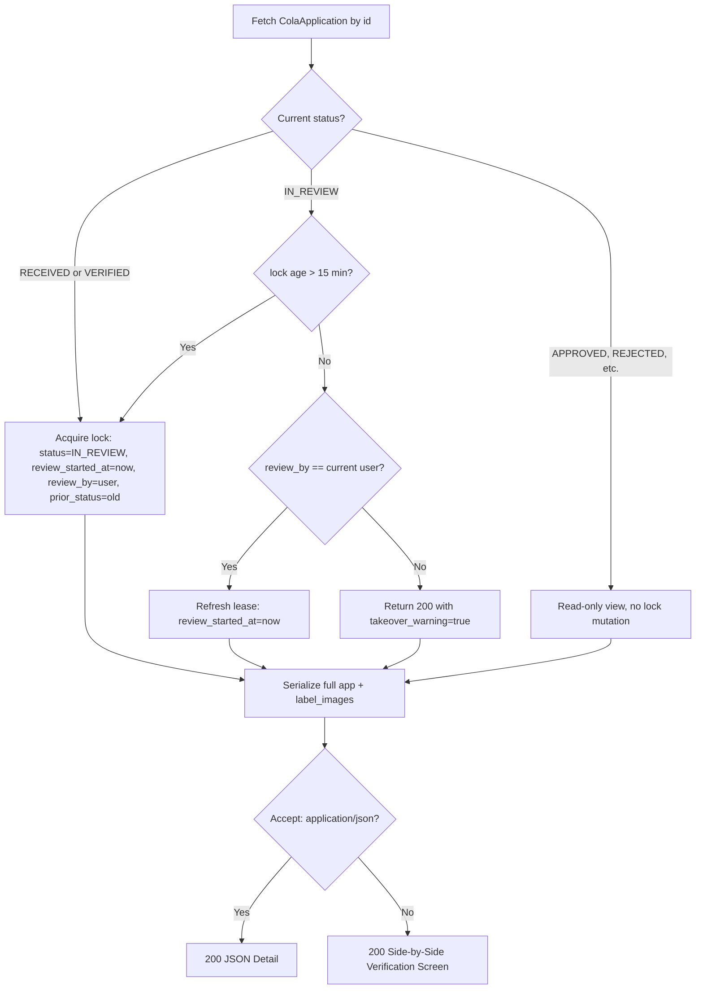

# CORA `/application` Endpoint — Consolidated Design Document

This document consolidates all behavior specification describes the complete `/application` endpoint family:
- **POST** `/application` — Import a new COLA application (with label images)
- **GET**  `/application` — Search, filter, paginate, or return import form/schema
- **GET**  `/application/{id}` — Detail view with review lock acquisition
- **POST** `/application/{id}/release` — Release review lock on unload/abandon
- **GET**  `/application/import` — Alias for HTML import form (legacy route)

All routes share a single URL pattern (`/application`) with method/content-type dispatch.

---

## 1. Route Map



---

## 2. POST `/application` — Import Application

### 2.1 Request

| Aspect | Requirement |
|--------|-------------|
| Content-Type | `multipart/form-data` (required) |
| Form field `payload` | JSON string matching `IMPORT_PAYLOAD_SCHEMA` |
| Files | One per `label_images[].file_name` in payload |

### 2.2 Payload Schema (abridged)

```json
{
  "cola_application": {
    "ttb_id": "COLA-2026-000001",          // required, unique
    "applicant_name": "Example Winery",     // required
    "product_type": "WINE",                  // required: WINE|DISTILLED_SPIRITS|MALT_BEVERAGES
    "brand_name": "VINEYARD RESERVE",        // required
    "fanciful_name": "Estate Select",        // optional
    "grape_varietals": ["Cabernet Sauvignon"],
    "wine_appellation": "California",
    "distinctive_bottle_capacity": "750 mL",
    "date_of_application": "2026-07-01",
    "date_issued": "2026-07-02",
    "label_images": [                         // optional, max 4
      { "label_type": "BRAND", "file_name": "front.jpg" },
      { "label_type": "BACK",  "file_name": "back.jpg" }
    ]
  }
}
```

Allowed `label_type`: `BRAND`, `BACK`, `NECK`, `OTHER`.

### 2.3 Validation & Business Rules

| Rule | Check | On Fail |
|------|-------|---------|
| BR-001 | `ttb_id` unique | 409 Conflict (unless idempotent) |
| BR-002 | ≤ 4 label images | 422 |
| BR-003 | Atomic transaction | — (enforced by `transaction.atomic()`) |
| BR-004 | `label_type` in allowed set | 422 |
| BR-005/009 | Idempotent retry on duplicate `ttb_id` | Exact match → 200; mismatch → 409 |
| BR-006 | Strip server fields (`id`, timestamps) | Silently ignored |
| BR-007/013 | Structured audit log on success | — |
| BR-008 | Content negotiation | JSON or HTML response |
| BR-010 | Stream uploads via `TemporaryFileUploadHandler` | — |
| BR-011 | Max 1.5 MB/image; PNG/JPG only | 413/422 |
| BR-012 | Authorization (if enabled) | 401/403 |

### 2.4 Idempotency Flow



### 2.5 Responses

| Status | Trigger | JSON Body |
|--------|---------|-----------|
| 201 | New application created | `{ "success": true, "id": 123, "message": "Application imported." }` |
| 200 | Idempotent duplicate | `{ "success": true, "id": 123, "message": "Application imported (idempotent)." }` |
| 400 | Invalid JSON / missing payload | `{ "success": false, "reason": "missing_payload", ... }` |
| 409 | Duplicate `ttb_id` with differing data | `{ "success": false, "reason": "duplicate", "failing_field": "ttb_id", ... }` |
| 413 | File too large | `{ "success": false, "reason": "file_too_large", ... }` |
| 415 | Not `multipart/form-data` | `{ "success": false, "reason": "unsupported_media_type", ... }` |
| 422 | Validation failed (schema, types, sizes) | `{ "success": false, "reason": "validation_failed", "failing_field": "...", ... }` |
| 500 | Unexpected server error | `{ "success": false, "reason": "server_error", ... }` |

---

## 3. GET `/application` — List / Search / Schema / Form

### 3.1 Query Parameters

| Param | Type | Default | Notes |
|-------|------|---------|-------|
| `q` | string | — | Search `brand_name`, `fanciful_name`, `applicant_name`, `ttb_id` (icontains, max 200 chars) |
| `status` | string | — | Must be in `ALLOWED_STATUSES` |
| `product_type` | string | — | Must be in `ALLOWED_PRODUCT_TYPES` |
| `page` | int ≥ 1 | 1 | — |
| `limit` | int [1, 100] | 20 | — |
| `sort_by` | string | `date_of_application` | Must be in `ALLOWED_SORT_FIELDS` |
| `order` | string | `desc` | `asc` or `desc` |

`ALLOWED_STATUSES`: `RECEIVED`, `APPROVED`, `VERIFIED`, `IN_REVIEW`, `CONDITIONALLY_APPROVED`, `NEEDS_CORRECTION`, `REJECTED`, `SURRENDERED`, `WITHDRAWN`  
`ALLOWED_PRODUCT_TYPES`: `WINE`, `DISTILLED_SPIRITS`, `MALT_BEVERAGES`  
`ALLOWED_SORT_FIELDS`: `date_of_application`, `created_at`, `brand_name`

### 3.2 Lock Handling in List Query

Expired `IN_REVIEW` locks (older than **15 minutes**) are **excluded** from the default queryset but remain visible in the DB so the next agent can see and take them over.

```python
lock_cutoff = now() - timedelta(minutes=15)
queryset = ColaApplication.objects.exclude(
    status='IN_REVIEW', review_started_at__lt=lock_cutoff
).all()
```

### 3.3 Content Negotiation

| Accept / HX-Request | Response |
|---------------------|----------|
| `Accept: application/json` (no `?schema=1`) | Paginated JSON list |
| `Accept: application/json` + `?schema=1` | JSON Schema for import payload |
| `HX-Request: true` (HTMX) | Partial HTML — `<tbody>` rows + pagination strip |
| Default (`text/html`) | Full dashboard HTML |

### 3.4 JSON Response Envelope

```json
{
  "success": true,
  "count": 142,
  "next": "/application?page=2&q=blue",
  "previous": null,
  "results": [
    {
      "id": "uuid-v7",
      "cola_application_id": 102548,
      "ttb_id": "COLA-2026-004587",
      "applicant_name": "Blue Ridge Cellars LLC",
      "product_type": "WINE",
      "brand_name": "Blue Ridge Reserve",
      "fanciful_name": "Moonlit Harvest",
      "status": "RECEIVED",
      "date_of_application": "2026-03-12"
    }
  ]
}
```

### 3.5 HTMX Wiring (Dashboard)

```html
<!-- Search input -->
<input id="search-input"
       name="q"
       hx-get="/application"
       hx-target="#results-body"
       hx-trigger="keyup changed delay:300ms"
       hx-include="#filter-form">

<!-- Status filter -->
<select name="status"
        hx-get="/application"
        hx-target="#results-body"
        hx-trigger="change"
        hx-include="#filter-form">
```

---

## 4. GET `/application/{id}` — Detail View with Lock Acquisition

### 4.1 Lock Logic (inside `transaction.atomic()`)



### 4.2 JSON Detail Response

```json
{
  "success": true,
  "application": {
    "id": "uuid-v7",
    "cola_application_id": 102548,
    "ttb_id": "COLA-2026-004587",
    "applicant_name": "Blue Ridge Cellars LLC",
    "product_type": "WINE",
    "brand_name": "Blue Ridge Reserve",
    "fanciful_name": "Moonlit Harvest",
    "grape_varietals": ["Cabernet Sauvignon", "Merlot"],
    "wine_appellation": "Virginia",
    "distinctive_bottle_capacity": "750 mL",
    "status": "IN_REVIEW",
    "date_of_application": "2026-03-12",
    "date_issued": "2026-04-02",
    "ttb_authorized_signature": "J. Anderson",
    "created_at": "2026-03-12T14:22:11Z",
    "updated_at": "2026-04-02T09:15:44Z",
    "review_started_at": "2026-07-01T14:30:00Z",
    "review_by": "agent@example.com",
    "prior_status": "RECEIVED",
    "label_images": [
      {
        "id": 550001,
        "label_type": "BRAND",
        "file_name": "front_label.png",
        "file_path": "/storage/cola/2026/03/COLA-2026-004587/front_label.png",
        "file_size_bytes": 2845912,
        "width_px": 2400,
        "height_px": 3600,
        "image_format": "PNG",
        "created_at": "2026-03-12T14:22:33Z"
      }
    ]
  },
  "takeover_warning": false
}
```

### 4.3 HTML Verification Screen

Side-by-side layout:
- **Left**: Label images (click to enlarge)
- **Right**: Extracted OCR text blocks mapped to label regions
- **Bottom**: Status transition form (`APPROVED`, `REJECTED`, `NEEDS_CORRECTION` + notes)
- **Audit Trail**: Status history with timestamps and agents

---

## 5. POST `/application/{id}/release` — Release Review Lock

### 5.1 Invocation

Called by `navigator.sendBeacon` on `window.beforeunload`. Also callable explicitly.

```javascript
window.addEventListener('beforeunload', () => {
    navigator.sendBeacon('/application/{{ application.id }}/release');
});
```

### 5.2 Logic (inside `transaction.atomic()`)

```python
app = ColaApplication.objects.select_for_update().get(id=id)
if app.status == 'IN_REVIEW' and app.review_by == request.user:
    app.status = app.prior_status or 'RECEIVED'
    app.review_started_at = None
    app.review_by = None
    app.prior_status = None
    app.save()
```

### 5.3 Response

| Status | Condition |
|--------|-----------|
| 204 | Lock released (or no-op if not owner/not locked) |
| 404 | Application not found |

Idempotent: safe to call multiple times.

---

## 6. GET `/application/import` — Legacy Import Form Alias

| Route | View | Purpose |
|-------|------|---------|
| `GET /application/import` | `application_import` | Renders `cora/import.html` (same as `GET /application` with `Accept: text/html`) |

Retained for backward compatibility and explicit bookmarking.

---

## 7. Database Model Summary (Relevant Fields)

```python
class ColaApplication(models.Model):
    id = UUIDField(default=uuid7, primary_key=True)
    cola_application_id = BigIntegerField(null=True, blank=True)
    ttb_id = CharField(max_length=50, unique=True, db_index=True)
    applicant_name = CharField(max_length=255)
    product_type = CharField(max_length=30, db_index=True)  # WINE, DISTILLED_SPIRITS, MALT_BEVERAGES
    brand_name = CharField(max_length=255, db_index=True)
    fanciful_name = CharField(max_length=255, null=True, blank=True)
    grape_varietals = JSONField(null=True, blank=True)
    wine_appellation = CharField(max_length=255, null=True, blank=True)
    distinctive_bottle_capacity = CharField(max_length=50, null=True, blank=True)
    status = CharField(max_length=30, default='RECEIVED', db_index=True)
    date_of_application = DateField(null=True, blank=True, db_index=True)
    date_issued = DateField(null=True, blank=True)
    ttb_authorized_signature = CharField(max_length=255, null=True, blank=True)
    review_started_at = DateTimeField(null=True, blank=True)
    review_by = CharField(max_length=255, null=True, blank=True)
    prior_status = CharField(max_length=30, null=True, blank=True)
    created_at = DateTimeField(auto_now_add=True)
    updated_at = DateTimeField(auto_now=True)
    archived_at = DateTimeField(null=True, blank=True)

class LabelImage(models.Model):
    cola_application = ForeignKey(ColaApplication, on_delete=CASCADE, related_name='label_images')
    label_type = CharField(max_length=30)  # BRAND, BACK, NECK, OTHER
    file_name = CharField(max_length=255)
    file_path = CharField(max_length=1024)
    file_size_bytes = BigIntegerField()
    width_px = IntegerField(null=True, blank=True)
    height_px = IntegerField(null=True, blank=True)
    image_format = CharField(max_length=10)  # PNG, JPG
    image = ImageField(upload_to='cola/{ttb_id}/')
    created_at = DateTimeField(auto_now_add=True)
```

---

## 8. URL Routing (cora/urls.py)

```python
urlpatterns = [
    path('', views.landing, name='landing'),
    path('admin/', admin.site.urls),
    path('application/import/', views.application_import, name='application_import'),
    path('application/', views.application_list, name='application_list'),
    re_path(r'^application/(?P<id>[0-9a-f-]{36})/?$', views.application_detail, name='application_detail'),
    re_path(r'^application/(?P<id>[0-9a-f-]{36})/release/?$', views.application_release, name='application_release'),
    path('status/', views.status, name='status'),
]
```

> **Note**: UUID pattern `([0-9a-f-]{36})` precedes the import route to avoid capture conflicts.

---

## 9. Security & Observability

| Concern | Implementation |
|---------|----------------|
| Authentication | Django auth (login_required / permission_required on views) |
| CSRF | `@csrf_exempt` on import endpoints (stateless API); form uses `` |
| File validation | MIME type check, 1.5 MB limit, Pillow header parse for dimensions |
| Audit logging | Structured JSON to `cora.audit` logger on every import/review action |
| Rate limiting | Not yet implemented (gap — see gaps doc) |

---

## 10. Test Matrix (Acceptance Criteria)

| # | Scenario | Expected |
|---|----------|----------|
| 1 | `POST /application` valid new app + images | 201 JSON/HTML |
| 2 | `POST /application` same payload again | 200 (idempotent) |
| 3 | `POST /application` same `ttb_id`, different data | 409 |
| 4 | `POST /application` missing payload field | 400 |
| 5 | `POST /application` image > 1.5 MB | 422 |
| 6 | `POST /application` 5 images | 422 |
| 7 | `POST /application` invalid `label_type` | 422 |
| 8 | `GET /application` `Accept: application/json` | 200 paginated JSON |
| 9 | `GET /application?schema=1` `Accept: application/json` | 200 JSON Schema |
| 10 | `GET /application` `Accept: text/html` | 200 import form HTML |
| 11 | `GET /application?q=blue` | 200 filtered |
| 12 | `GET /application?status=RECEIVED` | 200 filtered |
| 13 | `GET /application?page=2&limit=5` | 200 correct slice |
| 14 | `GET /application` `HX-Request` | 200 partial HTML |
| 15 | `GET /application/{id}` status=RECEIVED | 200, lock acquired, status=IN_REVIEW |
| 16 | `GET /application/{id}` expired lock | 200, lock re-acquired |
| 17 | `GET /application/{id}` active foreign lock | 200, `takeover_warning=true` |
| 18 | `GET /application/{id}` same agent return | 200, lease refreshed |
| 19 | `GET /application/9999` | 404 |
| 20 | `POST /application/{id}/release` by owner | 204, status reverted |
| 21 | `POST /application/{id}/release` by non-owner | 204 (no-op) |

---

## 11. Future Enhancements (Out of Scope)

- Cursor-based pagination for very large datasets
- WebSocket / SSE for real-time status updates
- Bulk import endpoint (`POST /application/bulk`)
- Full-text search (PostgreSQL `tsvector`) on label OCR text
- RBAC for reviewer assignment