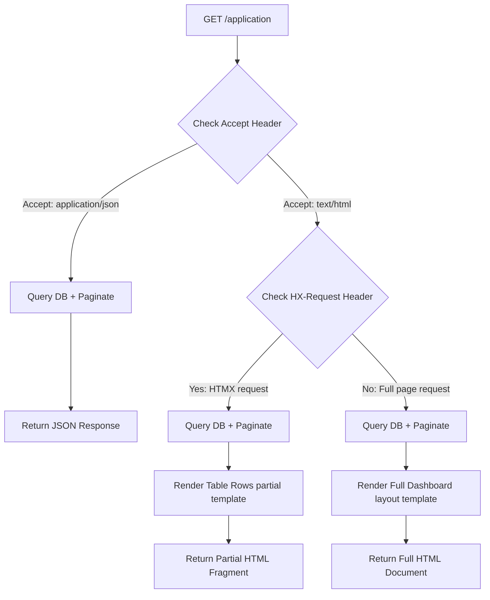

# Design Draft: `GET /application` Search & Filter

This document details the architectural design for the search, filter, and pagination capabilities of the `GET /application` endpoint in CORA.

---

## 1. Key Capabilities

- **Multi-parameter Filtering**: Filter applications by `status`, `product_type`, and date ranges.
- **Global Search**: Substring text matching across `brand_name`, `fanciful_name`, `applicant_name`, and `ttb_id`.
- **Content Negotiation**: Returns structured JSON for programmatic API requests and HTML views for browser clients.
- **HTMX Partial Updates**: Supports dynamic search-as-you-type and pagination in the browser by rendering and returning only the table rows fragment when queried via HTMX, reducing server payload and increasing UI responsiveness.
- **Database Optimizations**: Introduces column indexes to maintain query execution speeds below the 5-second performance SLA.

---

## 2. API Design & Query Parameters

| Query Field | Expected Type | Target Filter |
|---|---|---|
| `q` | String | Performs case-insensitive substring search on `brand_name`, `fanciful_name`, `applicant_name`, and `ttb_id`. |
| `status` | String | Matches app status (e.g. `RECEIVED`, `APPROVED`, `VERIFIED`). |
| `product_type` | String | Matches product types (e.g. `WINE`, `DISTILLED_SPIRITS`). |
| `page` | Integer | Page index (defaults to `1`). |
| `limit` | Integer | Page size limit (defaults to `20`, maximum `100`). |
| `sort_by` | String | Column sort (`date_of_application`, `created_at`, `brand_name`). Defaults to `date_of_application`. |
| `order` | String | Direction: `desc` (default) or `asc`. |

---

## 3. Architecture Flow



---

## 4. UI Dashboard Mockup & Interactivity

The frontend interface will incorporate:
1. **Interactive Filter Panel**: Dropdown menus for Status and Product Type, updating results instantly.
2. **Search-As-You-Type Input**: Uses HTMX trigger:
   `hx-trigger="keyup changed delay:300ms"`
   sending AJAX queries to `/application` automatically without full-page reloads.
3. **Active Indicators**: Micro-loading spinners indicating query execution status.
4. **Clean Grid/Table**: High-contrast, easy-to-read compliance grid with status badge styling (e.g., green for APPROVED, amber for RECEIVED).

---

## 5. Row-Click & Details View Routing (`GET /application/{id}`)

When a compliance agent selects or clicks a row in the search results table:
1. **Navigation Action**: The system navigates to `GET /application/{id}` (or loads it dynamically).
2. **Review Status Transition**: If the application's status is currently `RECEIVED` or `VERIFIED` (OCR completed), the system automatically updates its status to `IN_REVIEW` (enwrapped in a database transaction) to signal to other agents that the application is currently being evaluated.
3. **Details View Presentation**:
   - **Content Negotiation**:
     - `Accept: application/json` -> Returns a JSON representation of the application, including nested `label_images` list.
     - `Accept: text/html` -> Renders the detailed Side-by-Side Verification Screen, displaying:
       - The uploaded label images next to the corresponding extracted OCR text blocks.
       - A validation form to change status to `APPROVED` or `REJECTED` (with standard correction/issue notes).
       - Status audit trail logs.

### C. Handling "Navigating Away" (Abandoned Locks)
If an agent leaves the review screen without saving a decision (e.g., closing the browser, clicking "Back", or losing network connectivity), the application risk being orphaned in the `IN_REVIEW` state. We address this using a three-tier mitigation strategy:
1. **Lease-based Timeout (Server-side)**:
   - The `IN_REVIEW` status is treated as a temporary lease. We record `review_started_at` and `review_by_user`.
   - Active searches (`GET /application`) and detail retrievals treat locks older than **15 minutes** as expired. Expired locks are automatically eligible for reassignment or revert back to their prior state (`RECEIVED` or `VERIFIED`).
2. **Graceful Release (Client-side)**:
   - A JavaScript event listener checks the window's `beforeunload` event.
   - When triggered, it fires an asynchronous `navigator.sendBeacon` request to `/application/{id}/release` to release the lock immediately if the exit is orderly.
3. **Takeover Warning (UI)**:
   - If agent B opens an application currently locked by agent A, and the lock is still active, agent B is shown a warning: *"This application is currently being reviewed by [Agent Name] (started X minutes ago). Do you want to take over review?"*
   - Clicking *"Take Over"* updates the lock owner to agent B and resets the lease timer.

---

## 6. Proposed Database Model Indexes

To support fast queries, we propose modifying [models.py](file:///home/rcapozzi/src/cora/cora/models.py) to add indexes:

```python
class ColaApplication(models.Model):
    # ...
    status = models.CharField(max_length=30, default='RECEIVED', db_index=True)
    brand_name = models.CharField(max_length=255, db_index=True)
    product_type = models.CharField(max_length=30, db_index=True)
    date_of_application = models.DateField(null=True, blank=True, db_index=True)
    # ...
```

---

## 6. Feedback & Decisions Required

1. **Offset vs Cursor Pagination**:
   - *Offset Pagination (Recommended)*: Easiest to implement and exposes exact page numbers (1, 2, 3...) to compliance agents.
   - *Cursor Pagination*: Better performance for billions of rows but harder to build custom page navigation links.
2. **Default Page Size**:
   - Set to `20` records per page with option to expand up to `100` via dropdown.
3. **Sort Defaults**:
   - Default sorting by `date_of_application` in descending order so compliance agents see the newest submittals first.
