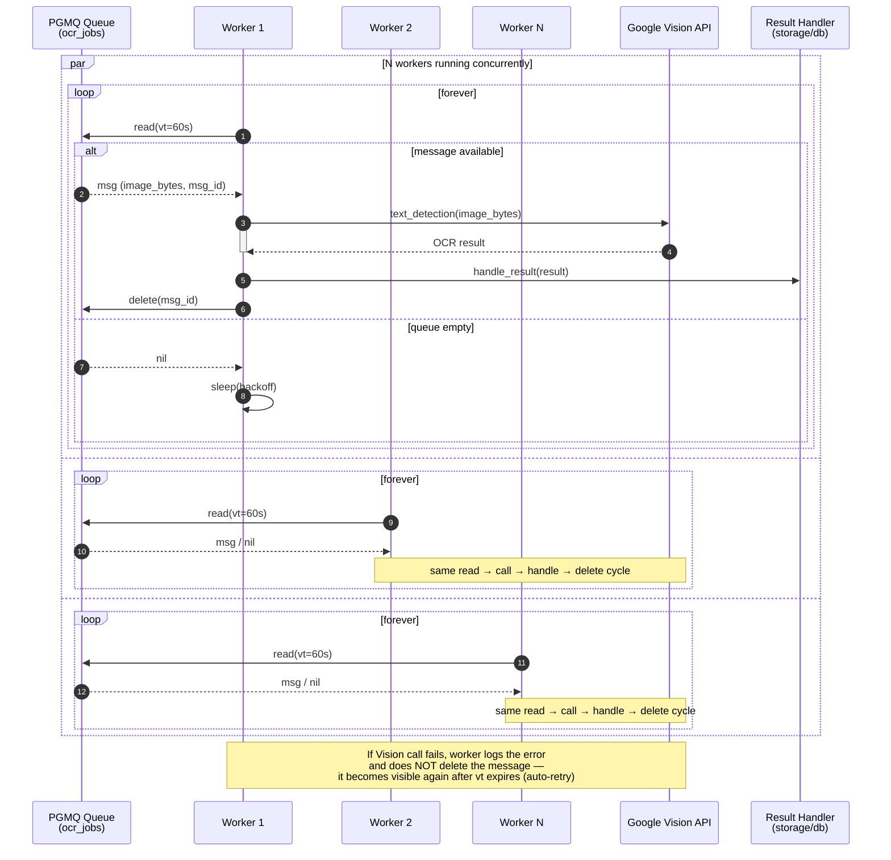

# OCR Worker Design

## Entrypoint
`cora/management/commands/ocr_worker.py` — management command, not `scripts/run_ocr_worker.py`.

## Concurrency Model
Concurrency is bounded by the `OCR_WORKERS` environment variable. The command spawns that many long-running **coroutines** via `asyncio.gather(*worker_pool)`. Each coroutine (`ocr_worker(worker_id)`) loops forever and processes one queue message at a time in sequential order inside that coroutine.

## Important detail
`pgmq` helpers and `process_ocr_job` are **synchronous** because they touch Django ORM and raw DB cursor I/O. The async wrapper offloads them with `asyncio.to_thread()`, so the worker pool does not make DB/queue calls async; it merely keeps the event loop responsive while bound worker threads run the actual I/O.

## Visibility-timeout / retry
On success the message is deleted. On failure the exception is caught per-message, the message is **not** deleted, and it reappears after `VISIBILITY_TIMEOUT` expires. There is no explicit backoff jitter; backoff is `EMPTY_QUEUE_BACKOFF` seconds after both empty reads and message-loop completion.

## Graceful shutdown
`handle()` wraps `asyncio.run(self.main())` and catches `KeyboardInterrupt` to exit cleanly. Default `KeyboardInterrupt` stops the event loop; there is no custom SIGTERM handler or in-flight drain logic.

## Config
| Env var | Default | Purpose |
|---------|---------|---------|
| `OCR_WORKERS` | `1` | Number of coroutines in the worker pool |curl -s -X POST 'http://localhost:8001/application/import -H Accept: text/html -F 'somefield=value'

## Flow
1. Initialize PGMQueue from env.
2. Spawn `OCR_WORKERS` coroutines running `ocr_worker(worker_id, queue)`.
3. Each worker loops:
   - `message = await queue.read(QUEUE_NAME, vt=OCR_VISIBILITY_TIMEOUT)`
   - If `None`: `await asyncio.sleep(OCR_EMPTY_QUEUE_BACKOFF)`, then retry.
   - Else:
     - Resolve payload to `application_id` and image reference.
     - Read image bytes from local media path.
     - Call OCR provider with timeout guard.
     - On success, persist OCR result and `await queue.delete(...)`.
     - On failure, log and **skip delete**, then retry later.

## Error handling
- OCR provider errors: log image/app context; do not delete.
- DB write-back errors: same as OCR failure.
- Unexpected exceptions: log, short sleep, continue loop.
- Graceful shutdown on SIGINT/SIGTERM: await in-flight workers, close queue.

## Concurrency and backoff
- Pool size from `OCR_WORKERS`.
- Each worker serializes read → OCR → delete for one message.
- Backoff defaults aligned with `demo_ocr_async.py`:
  - empty queue: ~`OCR_EMPTY_QUEUE_BACKOFF` seconds
  - error backoff: short fixed sleep

## Config
- `OCR_WORKERS`
- `OCR_QUEUE_NAME`
- `OCR_VISIBILITY_TIMEOUT`
- `OCR_EMPTY_QUEUE_BACKOFF`
- `OCR_PROVIDER`

