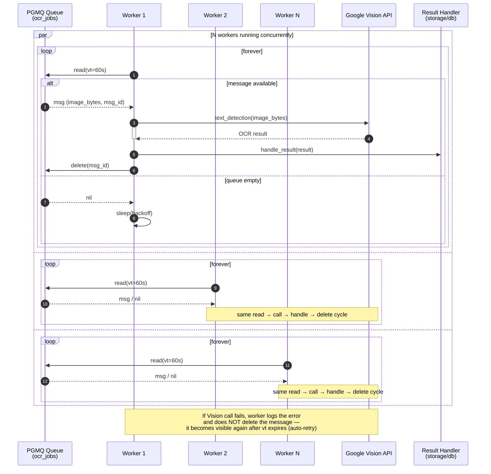

# OCR Worker Design

## Basis
`scripts/demo_ocr_async.py` defines the target async worker shape: an event-loop-driven pool of N worker coroutines, each calling `pgmq.read` with a visibility timeout, invoking the OCR provider, then `pgmq.delete` on success. This design reflects that pattern and maps it into the app.

## Goal
Process label-image OCR jobs from `q_label_images` with bounded concurrency, automatic retry on failure, and no side effects unless the job succeeds.

## Current state
- `cora/pgmq.py` provides `ensure_queue` and `enqueue_application`.
- `cora/tasks.py` has a synchronous `process_application` stub.
- No standalone worker process exists yet.

## Design
- Process model: long-running worker process, not a per-request thread.
- Concurrency: fixed-size async worker pool (`OCR_WORKERS`).
- Queue read: `pgmq.read(queue, vt=OCR_VISIBILITY_TIMEOUT, qty=1)`.
- Retry: if OCR or write-back fails, do **not** delete the message. It reappears after `vt`.
- Success path:
  - Run OCR provider call against image bytes.
  - Update `LabelImage` with OCR fields.
  - `pgmq.delete(queue, msg_id)`.
- Empty queue: backoff sleep before next read.

## Flow
1. Initialize PGMQueue from env.
2. Spawn `OCR_WORKERS` coroutines running `ocr_worker(worker_id, queue)`.
3. Each worker loops:
   - `message = await queue.read(QUEUE_NAME, vt=OCR_VISIBILITY_TIMEOUT)`
   - If `None`: `await asyncio.sleep(OCR_EMPTY_QUEUE_BACKOFF)`, then retry.
   - Else:
     - Resolve payload to `application_id` and image reference.
     - Read image bytes from local media path.
     - Call OCR provider with timeout guard.
     - On success, persist OCR result and `await queue.delete(...)`.
     - On failure, log and **skip delete**, then retry later.

## Error handling
- OCR provider errors: log image/app context; do not delete.
- DB write-back errors: same as OCR failure.
- Unexpected exceptions: log, short sleep, continue loop.
- Graceful shutdown on SIGINT/SIGTERM: await in-flight workers, close queue.

## Concurrency and backoff
- Pool size from `OCR_WORKERS`.
- Each worker serializes read → OCR → delete for one message.
- Backoff defaults aligned with `demo_ocr_async.py`:
  - empty queue: ~`OCR_EMPTY_QUEUE_BACKOFF` seconds
  - error backoff: short fixed sleep

## Config
- `OCR_WORKERS`
- `OCR_QUEUE_NAME`
- `OCR_VISIBILITY_TIMEOUT`
- `OCR_EMPTY_QUEUE_BACKOFF`
- `OCR_PROVIDER`

## Files to touch
- `cora/pgmq.py`: add async-capable read/delete helpers if needed, or keep sync helpers.
- `cora/tasks.py`: add `process_ocr_job(app_id, image_id)` used by worker.
- `scripts/run_ocr_worker.py`: async worker loop modeled on `demo_ocr_async.py`.
- `scripts/demo_ocr_async.py`: evolving reference implementation.

## Verification
- Ad-hoc script enqueues a message and asserts worker updates DB.
- Script simulates OCR failure and asserts message is not deleted.
