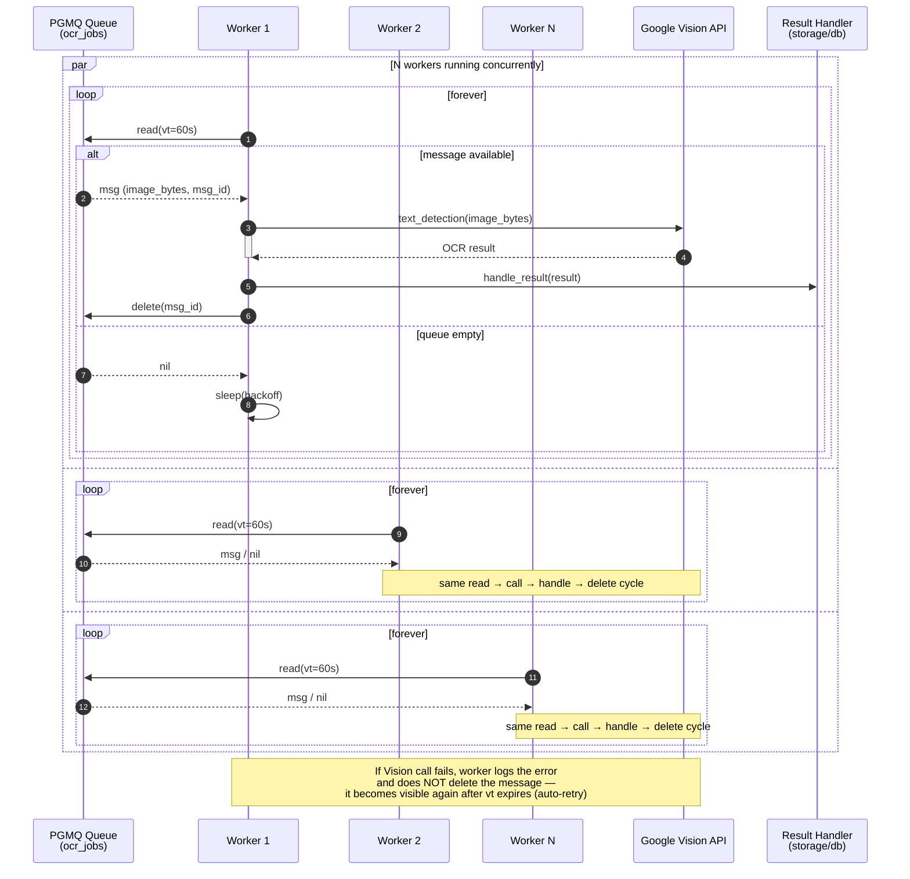

# OCR Task Worker

OCR is performed by the OCR Task worker process. This is done in an an async fashion. Work concurrency is throttled to a fix amount. The apporach avoid the semaphore trap while still keeping to a single threaded, async implementation. The trap refers to a situation where too many messages have been dequeued and they become stale and finally become visible to the queue again. Inserts to the Image table result in a notification to consumer task. These tasks are then feed into a fixed pool of worker process. The mechanics of the dequeing are abstracted away by the `PGMQ` API.

