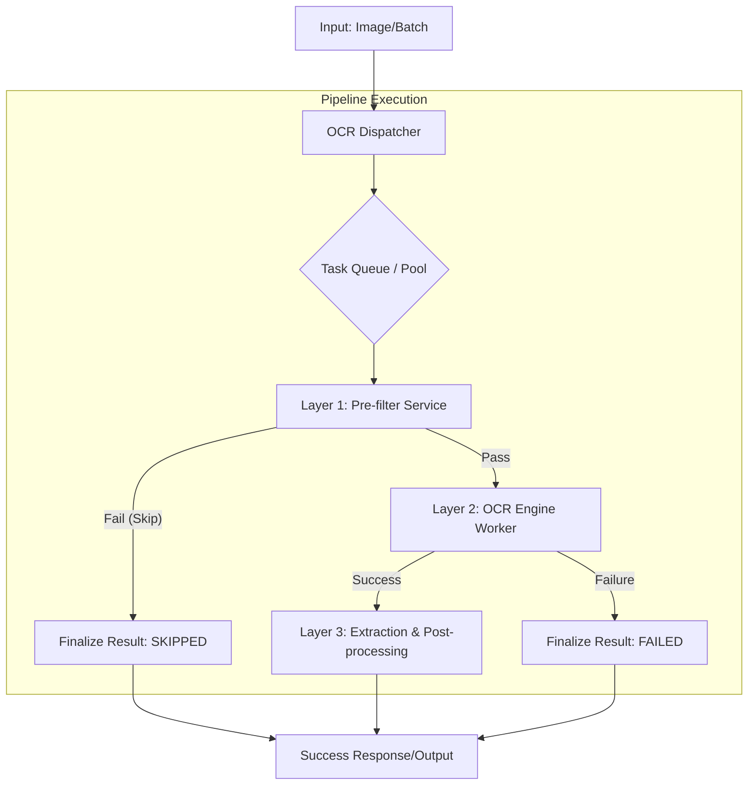
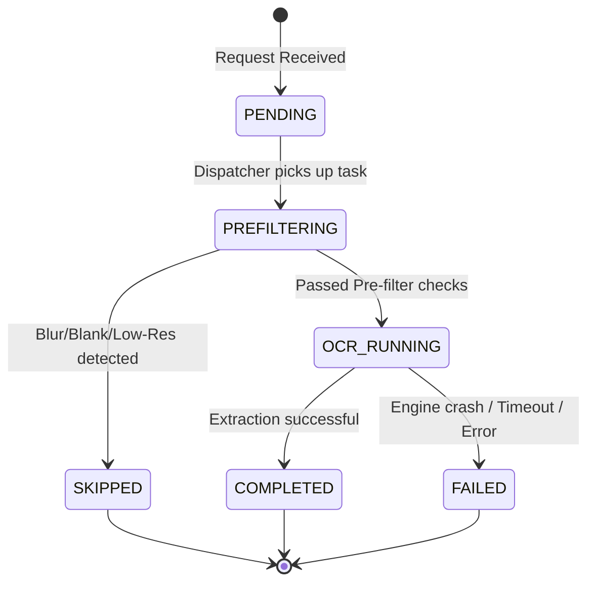

# Technical Design Document: OCR Process Improvement

## **1. Introduction**
### **Purpose**
This document outlines the technical architecture and implementation details for upgrading the CORA OCR pipeline. The objective is to transition from a generic single-pass extraction to an intelligent, multi-stage process that optimizes for cost, speed, and observability by introducing pre-filtering, managed concurrency, and structured failure reporting.

### **Scope**
Includes the design of the Pre-filter Component, the Concurrency Controller (Batch/Pool Manager), updated API responses, and a new database schema for tracking OCR job lifecycles.

---

## **2. System Architecture**

The upgraded pipeline follows a "Gatekeeper" pattern. Instead of directly invoking heavy extraction logic, every image passes through increasingly expensive layers of validation.



### **Key Architectural Layers**
1.  **Pre-filter Service (Low Cost):** Performs lightweight analysis (e.g., brightness variance, Laplacian variance for blur, edge density) to determine if an image is "worth" expensive OCR processing.
2.  **OCR Execution Manager (Medium Cost):** Orchestrates `run_ocr_image` calls. It manages the bounded concurrency pool to prevent system overload and implements retries for transient failures.
3.  **Post-processing Layer (High Cost/Complexity):** Performs structured data extraction (e.g., finding specific fields like "License Number" from the raw OCR text).

---

## **3. Components**

### **3.1 `OCR Pre-filter Service`**
*   **Responsibility:** Analyze image metadata and pixel histograms to detect known unprocessable states.
*   /   **Checks:**
    *   **Blankness Check:** Entropy-based detection of near-monochromatic images.
    *   **Blur Detection:** Laplacian variance check (threshold $\sigma^2 < T_{blur}$).
    *   **Resolution Check:** Ensure $\text{width} \times \text{height} > \min\_pixels$.

### **3.2 `OCR Execution Manager` (The Dispatcher)**
*   **Responsibility:** Acts as a semaphore-backed task runner.
*   /   **Features:**
    *   **Bounded Concurrency:** Limits active `run_ocr_image` subprocesses to $N$ concurrent workers.
    *   **Batching Logic:** Aggregates incoming single requests into groups for bulk processing if the input type is Batch.

### **3.3 `OCR Engine Wrapper`**
*   **Responsibility:** Wraps the existing `python manage.py run_ocr_image`.
*   /   **Wrapper logic:** Captures standard output, monitors for timeouts, and catches Python/C++ level crashes to translate them into structured error codes.

---

## **4. API Design**

### **4.1 Request Structure (Batch Implementation)**
`POST /api/v1/ocr/batch`
```json
{
  "task_id": "uuid-v4",
  "items": [
    {"image_path": "/mnt/c/uploads/img1.jpg", "metadata": {}},
    {"image_path": "/mnt/outputs/img2.png", "metadata": {}}
  ],
  "options": {
    "concurrency_limit": 5,
    "bypass_prefilter": false
  }
}
```

### **4.2 Response Structure**
The response must provide a status for *every* item in the batch.
`Response (Array of Results)`
```json
[
  {
    "image_path": "/mnt/outputs/img1.jpg",
    "status": "completed",
    "error_code": null,
    "failure_reason": null,
    "output_path": "/mnt/outputs/annotated_img1.jpg",
    "processing_time_ms": 450
  },
  {
    "image_path": "/mnt/outputs/img2.jpg",
    "status": "failed",
    "error_code": "ERR_PREFILTER_BLURRY",
    "failure_reason": "Image blur detected (Laplacian variance below threshold).",
    "output_path": null,
    "processing_time_ms": 45
  },
  {
    "image_path": "/mnt/outputs/img3.jpg",
    "status": "skipped",
    "error_code": "ERR_PREFILTER_BLANK",
    "failure_reason": "Image is too dark or blank.",
    "output_path": null,
    "processing_time_ms": 20
  }
]
```

---

## **5. Database Design**

To support observability and debugging (SRE requirements), we will persist job results in a `ocr_job_logs` table.

### **Table: `ocr_jobs`**
| Column | Type | Description |
| :--- | :--- | :--- |
| `id` | UUID (PK) | Unique identifier for the OCR task/batch element. |
| `input_path` | String | Path to source image. |
| `output_path` | String | Path to annotated/processed image. |
| `status` | Enum | `PENDING`, `PREFILTERING`, `OCR_RUNNING`, `COMPLETED`, `FAILED`, `SKIPPED`. |
| `error_code` | String (Nullable) | e.g., `ERR_PREFILTER_BLURRY`, `ERR_ENGINE_TIMEOUT`. |
| `failure_reason`| Text (Nullable) | Human-readable explanation for support/users. |
| `metadata` | JSONB | Stores metrics like blur score, entropy, or processing time. |
| `created_at` | Timestamp | Job initiation time. |
| `updated_at` | Timestamp | Last state transition. |

---

## **6. State Machine**

The lifecycle of an OCR request is governed by the following state machine. All transitions must be logged to `ocr_jobs`.



---

## **7. Error Handling & Failure Modes**

| Scenario | Error Code | Action/Result | Detection Method |
| :--- | :--- | :--- | :--- |
| Image is too blurry | `ERR_PREFILTER_BLURRY` | Skip OCR; Result: `SKIPPED` | Laplacian Variance < $T_{blur}$ |
| Image is black/blank | `ERR_PREFILTER_BLANK` | Skip OCR; Result: `SKIPPED` | Low Entropy / Pixel distribution |
| System Timeout | `ERR_ENGINE_TIMEOUT` | Terminate subprocess; Result: `FAILED` | Watchdog timer in `Execution Manager` |
| OCR Engine Crash | `ERR_ENGINE_CRASH` | Capture stderr; Result: `FAILED` | Subprocess exit code $\neq 0$ |
| Resource Exhaustion| `ERR_RESOURCE_DENIED`| Queue task/Backpressure; Result: `PENDING` | Semaphore/Pool limit reached |

### **Logging Strategy**
*   **Structured Logs:** All failures must emit a JSON log entry containing `job_id`, `error_code`, and `input_path`.
*   **Tracing:** Use the `task_id` to correlate Pre-filter logs with Engine logs for end-to-end debugging.
