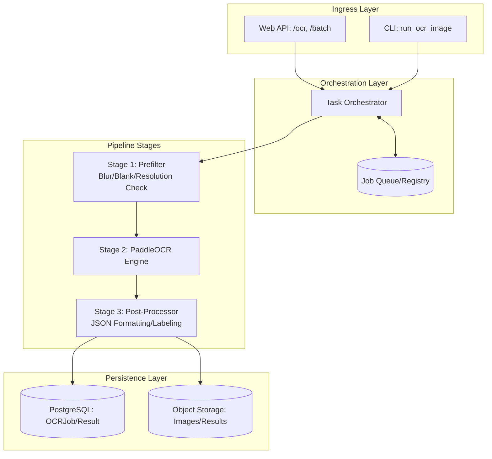

This **Technical Design Document (TDD)** translates the CORA OCR Pipeline Improvement PRD into a concrete implementation blueprint.

---

# Technical Design Document: CORA OCR Pipeline Optimization

**Status:** Draft | **Author:** Principal Software Engineer | **Project:** CORA (Compliance & OCR for Alcohol)

## 1. Executive Summary
The goal is to evolve the current synchronous, single-pass OCR process into an asynchronous, multi-stage pipeline. We will introduce a "Gatekeeper" (Prefilter) stage to prevent expensive compute on low-quality images and a structured "State Machine" to provide deterministic observability into job failures.

## t2. System Architecture
We will move from a **Linear Execution** model to a **Pipeline Orchestration** model.

### High-Level Component Diagram


---


## 3. Component Specifications

### 3.1 Task Orchestrator (The Brain)
*   **Responsibility:** Man/Manage the lifecycle of an `OCRJob`.
*   **Concurrency Control:** Implement a **Bounded Worker Pool**. 
    *   Maximum $N$ concurrent PaddleOCR instances globally.
    *   Use a semaphore or specialized worker queue to prevent OOM (Out of Duty Memory) errors during batch runs.
    *   Implement backpressure: If the queue is at capacity, return `429 Too Many Requests`.

### 3.2 Prefilter Module (The Gatekeeper)
*   **Logic:** Low-cost computer vision checks using OpenCV.
*   **Checks:**
    1.  **Format Check:** Is it a valid image? $\rightarrow$ `ERR_INVALID_FORMAT`
    2.  **Blank Check:** Variance of Laplacian to detect low texture (blankness). $\rightarrow$ `ERR_BLANK_IMAGE`
    3.  **Blur Detection:** Laplacian variance thresholding. $\rightarrow$ `ERR_TOO_BLURRY`
*   **Action:** If any check fails, transition job to `SKIPPED` and terminate pipeline early.

### 3.3 OCR Engine (The Heavy Lifter)
*   **Logic:** Wrapper around PaddleOCR.
*   **Responsibility:** Perform text extraction only if the Prefilter passes.
*   **Timeout Management:** Hard timeout per image to prevent "Zombie" processes from hanging the worker pool. $\rightarrow$ `ERR_TIMEOUT`

---

## 4. Data Design

### 4.1 Database Schema (PostgreSQL)

#### Table: `ocr_jobs`
| Column | Type | Description |
| :---  | :--- | :--- |
| `id` | UUID (PK) | Unique Job Identifier |
| `status` | Enum | `PENDING`, `PREFILTERING`, `PROCESSING`, `COMPLETED`, `SKIPPED`, `FAILED` |
| `failure_reason` | String | Deterministic error code (e.g., `ERR_BLURRY`) |
| `input_path` | String | S3/Local path to source image |
| `created_at` | Timestamp | Job initiation time |
| `completed_at` | Timestamp | Completion or failure time |
| `metadata` | JSONB | Params: e.g., `{ "batch_id": "xyz", "priority": 1 }` |

#### Table: `ocr_results`
| Column | Type | Description |
| :--- | :--- | :--- |
| `job_id` | UUID (FK) | Reference to `ocr_jobs.id` |
| `extracted_text` | Text | The raw string output from OCR |
| `confidence` | Float | Aggregate confidence score |
| `structured_data`| JSONB | Parsed fields (e.le. Alcohol %: 5.0) |

---

## 5. State Machine Definition
To satisfy the requirement of "why an image did not complete," the job must follow a strict state transition graph.

| Current State | Event | Next State | Action |
| :--- | :--- | :--- | :--- |
| `PENDING` | Job Created | `PREFILTERING` | Initialize metadata, allocate worker |
| `PREFILTERING` | Check Passed | `PROCESSING` | Hand off to PaddleOCR |
| `PREFILTER_ING` | Check Failed | `SKIPPED` | Log failure reason, release worker |
| `PROCESSING` | Extraction Success | `COMPLETED` | Save text to `ocr_results`, update DB |
| `PROCESSING` | Error/Timeout | `FAILED` | Record error code, alert SRE if critical |

---

## 6. API Design

### 6.1 POST `/v1/ocr` (Single Image)
**Request Body:**
```json
{
  "image_url": "s3://bucket/image.jpg",
  "options": { "high_precision": true }
}
```
**Response (202 Accepted):**
```json
{
  "job_id": "550e8400-e29b-41d4-a716-446655440000",
  "status": "PENDING",
  "links": { "status": "/v1/jobs/550e8400..." }
}
```

### 6.2 GET `/v1/jobs/{id}` (Status Polling)
**Response (200 OK
