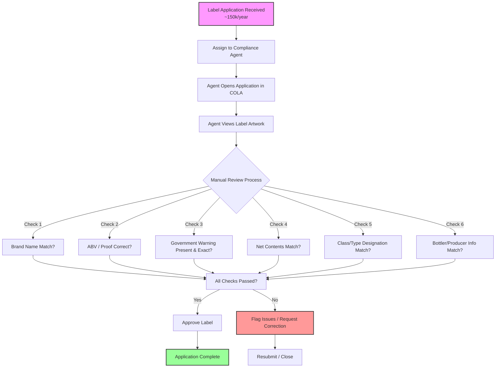
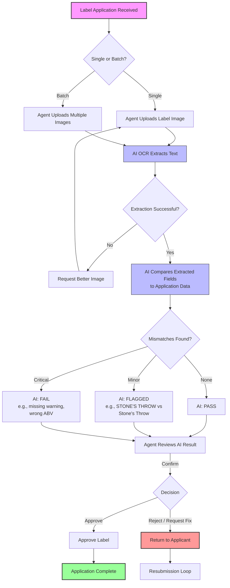

# TTB Label Review Workflow

## Current State: Manual Review ("As-Is")

**Pain Points:**
- **Throughput:** 5–10 min per label; queue bottlenecks during peak season (200–300 batch imports)
- **Repetition:** Agents spend ~50% of time on routine field matching
- **Speed:** OCR pilot took 30–40 sec/label; agents reverted to manual review
- **Usability:** Wide range of tech comfort; tool must be simple enough for non-technical staff

---

## Proposed State: AI-Assisted Review ("To-Be")

**Improvements:**
- **Speed:** Target <5 sec per label for AI extraction + comparison
- **Batch Support:** Process multiple labels without per-label waiting
- **Focus:** Agents spend time on judgment calls, not raw matching
- **Accessibility:** Clean UI with obvious actions; no training required

---

## Key Business Rules

1. **Government Warning:** Must be exact match, all caps, bold. Any deviation = reject.
2. **Brand Name:** Case-insensitive semantic match accepted (e.g., `STONE'S THROW` = `Stone's Throw`).
3. **ABV / Proof:** Must match application exactly.
4. **Batch Processing:** Must support multi-file upload; results returned as a list, not paginated.
5. **Response Time:** Agent must see result in <5 seconds or they will abandon the tool.
